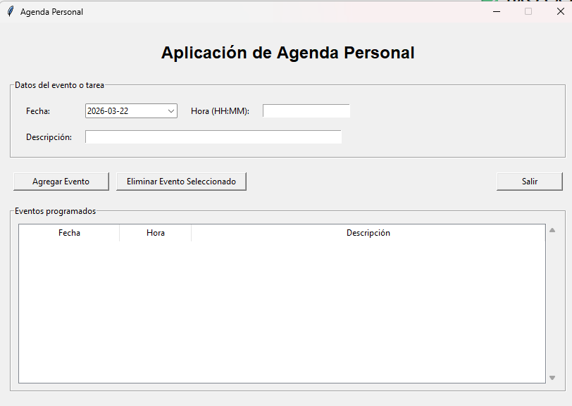
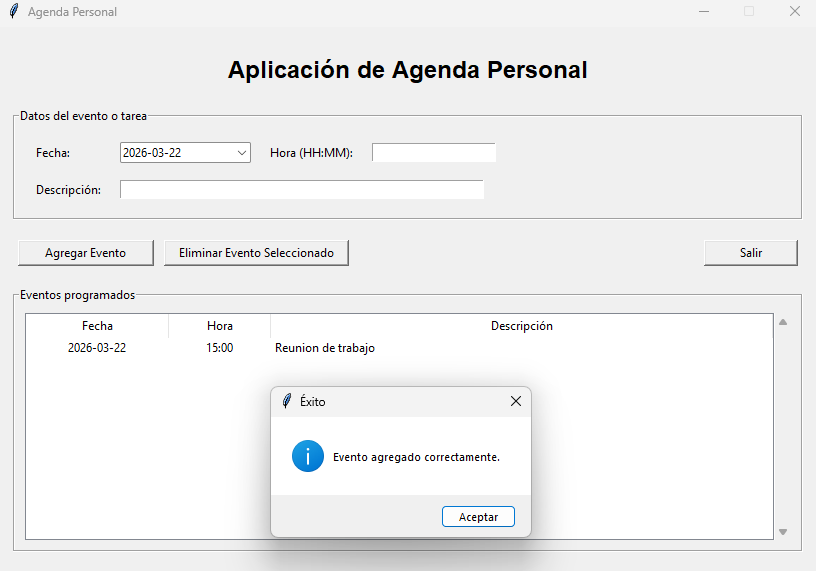
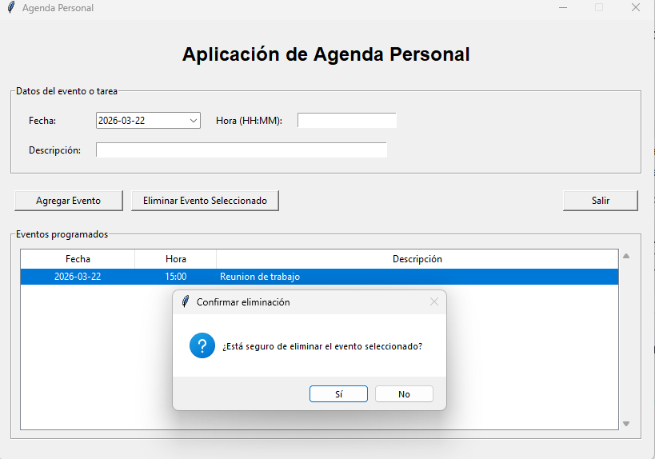
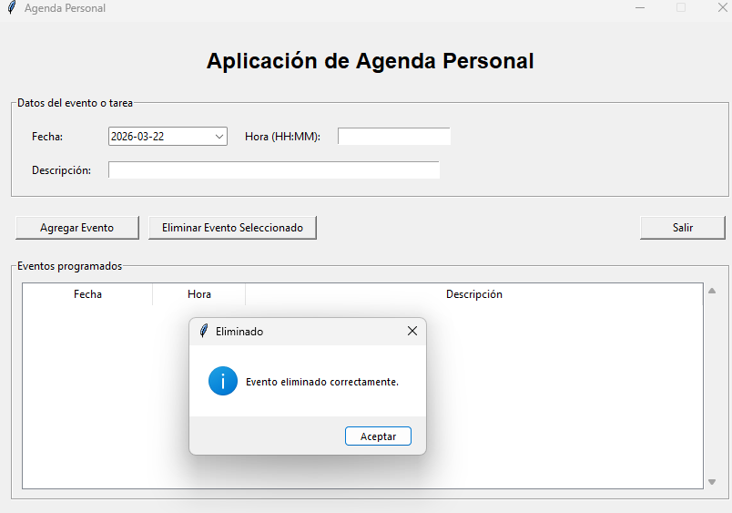

# Aplicación de Agenda Personal

## Descripción
Aplicación desarrollada en Python utilizando Tkinter y Programación Orientada a Objetos. Permite gestionar eventos personales.

## Funcionalidades
- Selección de fecha mediante DatePicker
- Ingreso de hora y descripción del evento
- Visualización de eventos en tabla Treeview
- Eliminación de eventos seleccionados
- Confirmación antes de eliminar
- Interfaz organizada con Frames y Labels

## Tecnologías utilizadas
- Python
- Tkinter
- ttk
- tkcalendar

## Requisitos
Instalar la librería:

```bash
pip install tkcalendar
## Evidencias

### Inicio del programa


### Agregar evento


### Eliminar evento


### Evento eliminado

## Autor
Jefferson Galeas